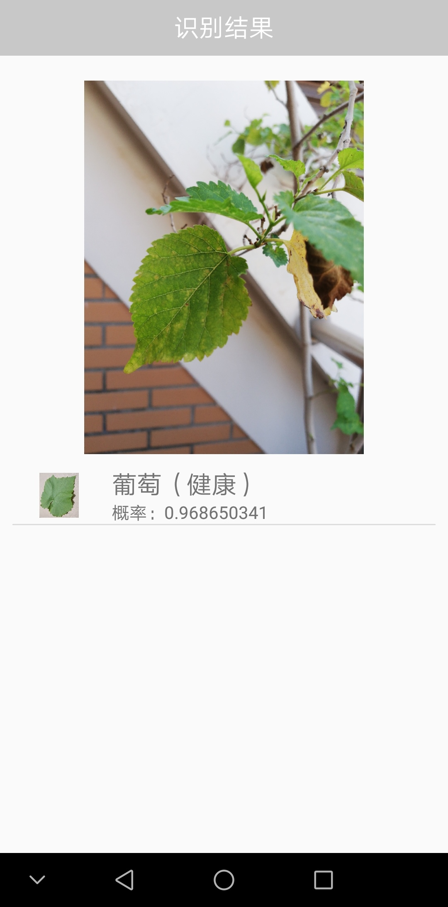

# 智农/AI识农害

> 智农作物病虫害识别程序

### 使用方法

1. 拍摄或从图库中选择待识别的作物图片
2. 点击“确认上传”，得到识别结果
3. 点击某个识别结果，查看详细信息

### 服务端

Microsoft Azure 自定义视觉API

### 客户端

Android APP，支持Android 5.0以上版本

### 开发环境

Android Studio

### 使用的第三方库

OKHttp

## 设计构架

### 总体思路

客户端通过服务器API发送目标图片，服务端根据神经网络模型返回目标结果

### 拍摄模块

调用系统摄像机，保存用户的图片用于上传

### 图片选择模块

从图库中选择一张图片，裁剪后保存，用于上传

### Http通信模块

发送图片至服务器，解析服务器返回的识别结果

### 结果展示模块

显示结果列表，支持查看某种结果的详细信息

